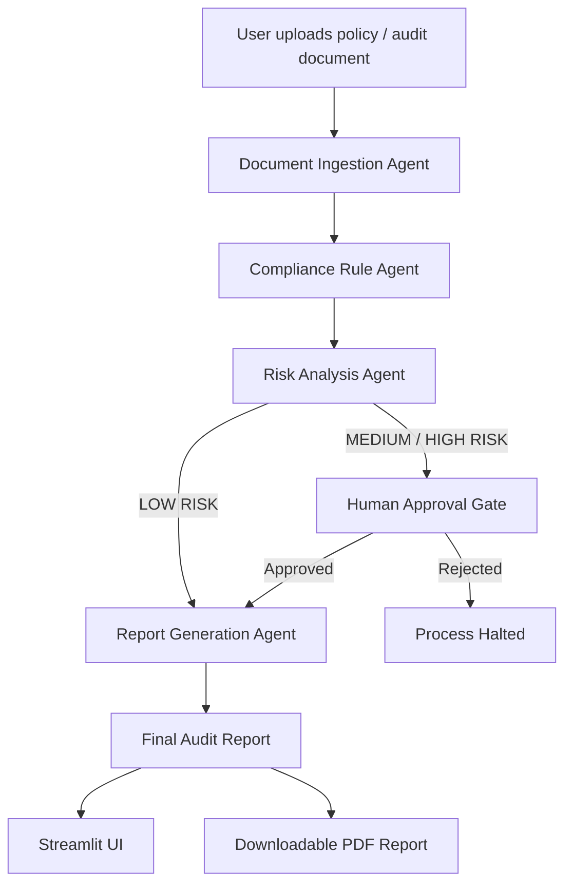

# 🏛️ Agentic Audit & Compliance Assistant

An enterprise-focused **Agentic AI Proof of Concept (POC)** that automates compliance audits using a **multi-agent architecture**, explicit **human-in-the-loop approvals**, and **explainable decision traces**.

Built to demonstrate how **Agentic AI systems** can be safely and responsibly applied in **regulated industries** such as **banking, fintech, and audit firms**.

---

## 🚀 Key Features

- Multi-agent orchestration using **LangGraph**
- Clearly defined agent responsibilities
- Human-in-the-loop approval for medium and high-risk outcomes
- Explainable agent execution trace (auditability)
- Formal internal audit report generation
- Downloadable PDF audit reports
- Streamlit-based interactive UI
- Designed as a scalable, enterprise-ready POC

---

## 🧠 System Architecture

---

## Architecture highlights:

-Each agent has a single, well-defined responsibility
-No autonomous high-impact decisions without human approval
-Explicit decision boundaries suitable for regulated environments

---

## 🧩 Agent Responsibilities

1️⃣ Document Ingestion Agent

-Extracts raw text from PDF or TXT files
-Captures basic metadata (word count, ingestion status)
-Prepares document for downstream analysis

2️⃣ Compliance Rule Agent

-Evaluates document against predefined compliance rules
-Identifies missing or weak controls
-Produces evidence-backed compliance findings

3️⃣ Risk Analysis Agent

-Assesses overall risk level (LOW / MEDIUM / HIGH)
-Evaluates business impact and regulatory exposure
-Provides justification for risk classification

4️⃣ Report Generation Agent

-Generates a formal internal audit report
-Includes executive summary, findings, risk assessment, and recommendations
-Adds AI decision boundaries and disclaimers

---

## 🧑‍⚖️ Human-in-the-Loop Design

For MEDIUM and HIGH risk outcomes:

-Report visibility and PDF download require explicit human approval
-Mimics real-world audit and regulatory workflows
-Prevents autonomous high-impact decisions
-Aligns with Responsible AI and governance principles

---

## 🧭 Explainability & Auditability

-Each agent logs its execution status and summary
-Execution trace is visible in the UI
-Enables transparency for auditors, reviewers, and regulators

---

## 🖥️ Tech Stack

-Python

-LangGraph – Agent orchestration

-LangChain Core

-Groq API – LLM inference

-Streamlit – Interactive UI

-ReportLab – PDF generation

---

## Installation & Run
Clone the repository:

git clone [https://github.com/your-repo/agentic-audit.git](https://github.com/your-repo/agentic-audit.git)
cd agentic-audit

Install dependencies:

pip install -r requirements.txt
Set up environment variables: Create a .env file and add your Groq API key:

GROQ_API_KEY=your_api_key_here
Run the application:

streamlit run app.py

---

## 🎯 Intended Use Cases

-Internal compliance audits
-GRC (Governance, Risk & Compliance) automation demos
-Enterprise Agentic AI proof-of-concepts
-Regulated AI system prototypes